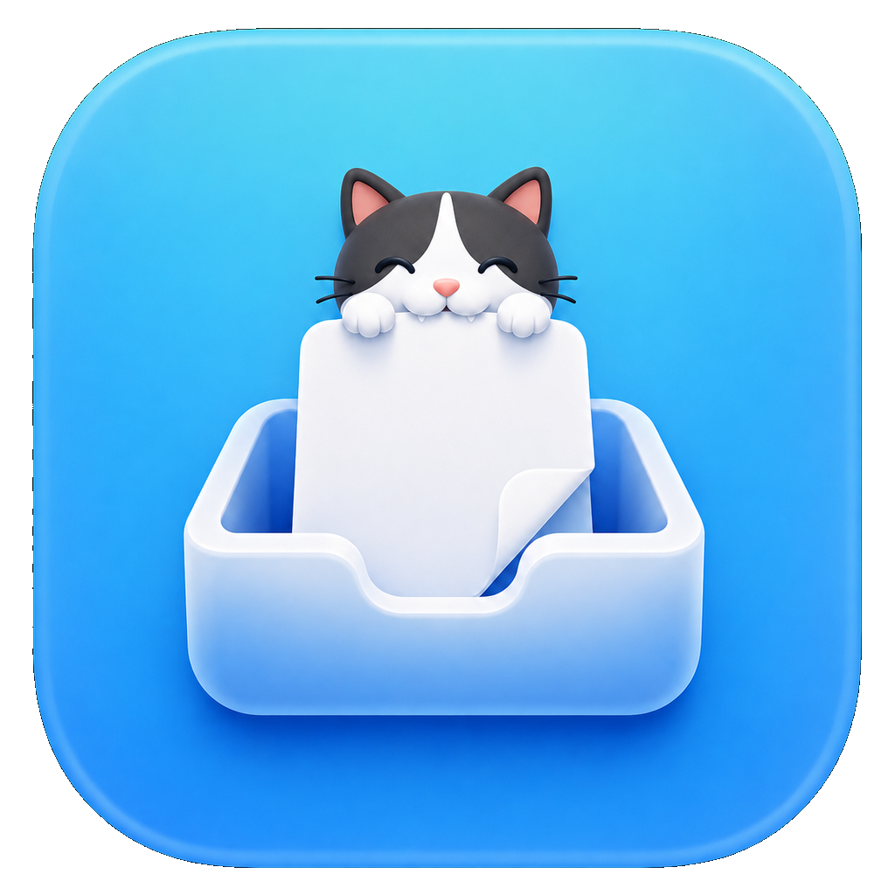

# ClipScylf

<p align="center">
  
</p>

ClipScylf is a small macOS menu bar utility for turning copied file URLs into a drag-and-drop shelf.

The app watches the system pasteboard for files copied from tools such as yazi or Finder, shows a small floating mini window, and expands into a file tray that can drag files into apps such as Teams, Mail, and browsers.

## Current Shape

- Product name: `ClipScylf`
- Previous working name: `QuickDrop`
- Main source path: `Sources/QuickDrop/main.swift`
- Swift package target: `ClipScylf`
- App bundle: `build/ClipScylf.app`
- Bundle id: `local.clipscylf`

The source folder still uses `Sources/QuickDrop` during the rename transition. That is intentional for now; do not infer that the product name is still QuickDrop.

## Build

```sh
./build.sh
```

This builds a release binary and creates:

```text
build/ClipScylf.app
```

## Behavior

- Runs as a menu bar app with no Dock icon.
- Starts in a windowless monitoring state.
- Reads existing file URLs from the clipboard on launch.
- Watches `NSPasteboard.general.changeCount` for new copied files.
- Shows a bottom-left mini window when new file URLs arrive.
- Expands the mini window into the main tray.
- Closing the main tray returns to the mini window.
- Closing the mini window hides it and keeps monitoring.
- Supports multiple selection and drag-and-drop.
- Supports select all through the button and `Cmd+A`.
- Keeps up to 20 copied file entries.

## Development Notes

- App Sandbox is intentionally off.
- Shortcut handling is intentionally outside the app.
- File operations such as move, delete, and rename are out of scope.
- Use `AGENTS.md` and `CLAUDE.md` for project direction and agent handoff context.

## 日本語

ClipScylfは、コピー済みのファイルURLをドラッグ&ドロップ用の棚にするmacOSメニューバーアプリです。

yaziやFinderでコピーしたファイルをシステムクリップボードから読み取り、小さなフローティングウィンドウに表示します。そこからTeams、Mail、ブラウザなどへ、通常のファイルとしてドラッグ&ドロップできます。

### ビルド

```sh
./build.sh
```

生成物:

```text
build/ClipScylf.app
```

### 主な動作

- Dockアイコンなしのメニューバーアプリとして動作します。
- 起動中はクリップボードのファイルURLを監視します。
- 新しいファイルURLを検知すると、左下にミニウィンドウを表示します。
- ミニウィンドウから通常ウィンドウへ展開できます。
- 複数選択とまとめてドラッグ&ドロップに対応します。
- 最大20件まで保持します。

### 開発メモ

- App Sandboxはオフです。
- ショートカット起動はアプリ外のツールに任せます。
- ファイルの移動、削除、リネームは扱いません。
