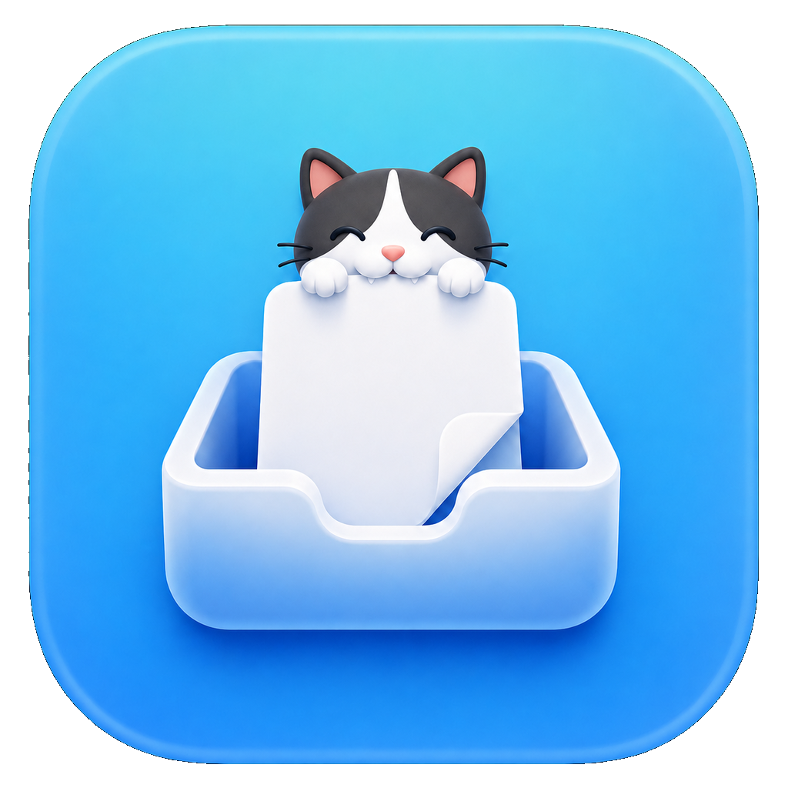

# ClipScylf — コピーしたファイルをドラッグ&ドロップできるmacOS用の棚

<p align="center">
  
</p>

[](LICENSE)
[](#動作要件)
[](Package.swift)

**[English documentation is in README.md →](README.md)**

---

ClipScylfは、**コピーした**ファイルをフローティングの棚に溜めて、そこからドラッグ&ドロップできるようにするmacOSメニューバーアプリです。`NSPasteboard.general.changeCount` を0.5秒ごとに監視し、Finder、ターミナルファイラの [yazi](https://github.com/sxyazi/yazi)、その他ファイルURLをペーストボードに書き込むアプリからファイルがコピーされると、画面左下の小さなウィンドウにそのファイルを積みます。YoinkやDropoverのような棚アプリはファイルを棚に載せるために*ドラッグ操作*が必要ですが、ClipScylfは `Cmd+C` で棚が埋まるので、マウスに触れずにファイルを集められます。

> **これは個人利用向けの未署名アプリです。** App Sandboxはオフで、バイナリへのコード署名も公証もしていません。`./build.sh` で自分でビルドして使います。Mac App Storeでは配布していません。

## クイックスタート

```sh
git clone https://github.com/hnsol/clip-scylf.git
cd clip-scylf
./build.sh                      # build/ClipScylf.app が生成されます
open build/ClipScylf.app        # Dockアイコンなしのメニューバー常駐で起動します
```

あとはFinderで `Cmd+C` を押してファイルをコピーしてください。画面左下に240×76のミニウィンドウが現れ、ファイルが積まれます。そこからTeams、Mail、Slack、ブラウザのアップロード欄へドラッグしてください。

yaziから棚に流し込みたい場合は [yaziのセットアップ](#yaziのセットアップ) を参照してください。yazi標準の `y` はmacOSのペーストボードに届かないため、キーバインドを1つ用意する必要があります。

## yaziのセットアップ

**yazi標準の `y` はClipScylfでは機能しません。** これはyazi内部のクリップボードへのヤンクで、yaziプロセス内で完結し、`NSPasteboard` には一切触れません。そのためClipScylfからは何も見えません。実際のファイルURLをmacOSのペーストボードへ書き込むには、その処理を行うプラグインにキーを割り当ててください。

動作する一式を [examples/yazi/](examples/yazi/) に同梱しています。コピーするだけで使えます。

```sh
mkdir -p ~/.config/yazi/scripts ~/.config/yazi/plugins
cp examples/yazi/copy-files-to-pasteboard.swift ~/.config/yazi/scripts/
cp -R examples/yazi/system-clipboard.yazi ~/.config/yazi/plugins/
cat examples/yazi/keymap-snippet.toml >> ~/.config/yazi/keymap.toml
```

yaziを再起動してファイルを選択し、`;y` を押してください。以下はこの3つのファイルの中身の説明です。

`~/.config/yazi/scripts/copy-files-to-pasteboard.swift` は、渡されたパスをファイルURLとしてペーストボードへ書き込みます。

```swift
#!/usr/bin/env swift
import AppKit
import Foundation

let paths = Array(CommandLine.arguments.dropFirst())
guard !paths.isEmpty else {
    fputs("No files specified\n", stderr)
    exit(1)
}
let urls = paths.map { NSURL(fileURLWithPath: $0) }
let pasteboard = NSPasteboard.general
pasteboard.clearContents()
if !pasteboard.writeObjects(urls) {
    fputs("Failed to write files to pasteboard\n", stderr)
    exit(1)
}
```

`~/.config/yazi/plugins/system-clipboard.yazi/main.lua` は、選択中（またはホバー中）のファイルを集めて上記スクリプトへ渡します。

```lua
local selected_or_hovered = ya.sync(function()
	local tab, paths = cx.active, {}
	for _, u in pairs(tab.selected) do
		paths[#paths + 1] = tostring(u)
	end
	if #paths == 0 and tab.current.hovered then
		paths[1] = tostring(tab.current.hovered.url)
	end
	return paths
end)

return {
	entry = function()
		ya.emit("escape", { visual = true })
		local paths = selected_or_hovered()
		if #paths == 0 then return end
		local script = os.getenv("HOME") .. "/.config/yazi/scripts/copy-files-to-pasteboard.swift"
		Command("swift"):arg(script):arg(paths):output()
	end,
}
```

上の掲載は簡略版です。[examples/yazi/](examples/yazi/) に入っているものは、エラー通知とコピー件数の通知も出します。

そして `~/.config/yazi/keymap.toml` のこの記述がキーを割り当てます。

```toml
[[mgr.prepend_keymap]]
on   = [ ";", "y" ]
run  = "plugin system-clipboard copy"
desc = "Copy files to system clipboard"
```

これでyaziの `;y` が選択ファイルをmacOSのペーストボードへコピーし、ClipScylfが0.5秒以内に拾います。キーは好きなものを選んで構いません。`;y` はyazi標準の `y` を潰さないための一例です。

## クリップボードからドラッグ&ドロップへの仕組み

macOSには、コピーしたファイルを保持しておいて後からドロップする標準の手段がありません。`Cmd+V` はFinderのフォルダには貼り付けられますが、Teamsのメッセージ入力欄やブラウザのファイル選択欄には貼り付けられません。ClipScylfはその隙間を埋めます。

1. `Timer` が `NSPasteboard.general.changeCount` を **0.5秒ごと** に監視します。
2. 変化を検知すると `readObjects(forClasses: [NSURL.self], options: [.urlReadingFileURLsOnly: true])` でファイルURLを読み取ります。プレーンテキストのパスは意図的に無視し、実際のファイルURLだけを対象にします。
3. 新しいファイルはリストの先頭に積まれます。同じファイルを再度コピーすると、重複させずに先頭へ移動します。保持上限は **20件** です。
4. ミニウィンドウが左下に表示されます。クリックすると360×420のトレイに展開し、全リストが見られます。
5. 行（またはミニウィンドウそのもの）をドラッグすると標準の `NSDraggingSession` が始まり、ファイルURLがそのまま渡されます。受け取り側のアプリには元のファイル名を保ったまま通常のファイルとして届きます。

どちらのウィンドウも `.nonactivatingPanel` かつ `level = .floating` の `NSPanel` です。他のウィンドウより前面に出続けますが、入力中のアプリからフォーカスを奪いません。

## ドラッグトレイの機能

- **ドラッグではなくクリップボードで集める** — `Cmd+C` でファイルが棚に入るので、Finderのキーボード操作や上記設定を入れたyaziなど、キーボード中心のワークフローでもマウスに持ち替える必要がありません。
- **フォーカスを奪わないフローティングパネル** — TeamsやMailの上に棚が出ますが、入力中のテキスト欄からフォーカスは移りません。
- **複数ファイルの一括ドラッグ** — トレイで複数行を選択して1回のドロップで渡せます。ドラッグ中のプレビューには件数付きの重ねカード画像が出ます。
- **ミニウィンドウから直接ドラッグ** — 240×76のミニウィンドウ自体をドラッグできるので、1ファイルならトレイを開かずに送り出せます。
- **ファイル名を保持** — ファイルURLをそのまま渡すため、受け取り側には一時ファイル名ではなく `report-2026.pdf` のような本来の名前で添付されます。
- **重複排除** — 同じファイルを再コピーすると行が増えず、先頭へ移動します。
- **20件の上限** — 古いものから自動的に落ちます。履歴データベースはなく、ディスクには何も書き込みません。
- **メニューバー常駐** — `LSUIElement` を有効にしているため、Dockアイコンもアプリスイッチャーへの表示もありません。
- **依存ゼロ** — アプリ全体が1ファイル966行のSwiftで、サードパーティ製パッケージを一切使いません。

## ClipScylf・Yoink・Dropover・Finderの比較

| | ClipScylf | Yoink | Dropover | Finderのみ |
|---|---|---|---|---|
| 価格 | 無料 / MIT | 有料（App Store） | 無料 / 有料プラン | 標準搭載 |
| 棚へのファイルの入れ方 | コピー（`Cmd+C`） | 棚へドラッグ | 棚へドラッグ | 該当なし |
| マウスなしで集められるか | はい（収集時） | いいえ | いいえ | いいえ |
| 複数ファイルの一括ドラッグ | 対応 | 対応 | 対応 | 対応（ドラッグのみ） |
| 終了後も保持されるか | いいえ（メモリのみ） | はい | はい | 該当なし |
| 署名・公証 | なし（自前ビルド） | あり | あり | あり |
| ソース公開 | あり | なし | なし | なし |
| 導入方法 | clone + `./build.sh` | App Storeから導入 | ダウンロードして導入 | 不要 |

**ClipScylfが向いている場合**: yaziのようなターミナルファイラやFinderのキーボード操作でファイルをコピーしていて、ドラッグ操作なしで棚に溜まっていてほしいとき。かつSwift Packageを自分でビルドすることに抵抗がないとき。

**YoinkやDropoverが向いている場合**: 署名済みでサポートのある完成度の高い棚アプリが欲しく、保存機能やファイルプレビュー、ドラッグでの収集を求めるとき。有料でも構わない、あるいはクリップボード連携が不要なとき。

**Finderだけで十分な場合**: コピー元とドロップ先が同時に画面に見えていて、1回のドラッグで済むとき。

## こんな人向けです

- **yaziなどのターミナルファイラを使う人** — ターミナルでファイルを選び、Finderに切り替えてドラッグすることなくTeamsのメッセージやブラウザのアップロード欄へ渡したい方。キーバインドを1つ足すだけで選択中のファイルをペーストボードへ送れます（[セットアップ](#yaziのセットアップ)）。
- **キーボード中心でmacOSを使う人** — Finderでキーボードからファイルを選び、2つのウィンドウ間でドラッグを狙うより `Cmd+C` を押したい方。
- **Webアプリへのファイル添付が多い人** — Teams、Gmail、Slack、各種アップロードフォームはいずれもOSレベルのファイルドロップを受け付けます。ClipScylfはそれらの前面に居座る安定したドラッグ元になります。
- **小さな参照実装を求めるSwift開発者** — `NSPanel` + SwiftUI + `NSTableView` のドラッグ元実装が1ファイルにまとまっており、Xcodeなしでビルドできます。

## 使い方

**ファイルをコピーします。** Finderなら `Cmd+C`、yaziなら [yaziのセットアップ](#yaziのセットアップ) で割り当てたキーです。画面左下にミニウィンドウが現れます。

**トレイに展開します。** ミニウィンドウをクリックすると、360×420のパネルになり、コピーしたファイルが新しい順に並びます。

**ファイルをドラッグして出します。** 行（複数選択も可）を対象アプリへドラッグしてください。ミニウィンドウ自体をドラッグすると、その時点のスタックをまとめて送れます。

**リストを管理します。** トレイでは `Cmd+A` または「全選択」ボタンで全選択、「クリア」ボタンで全件削除、行の削除ボタンでその行だけ削除できます。選択行を右クリックすると「リストから削除」が出ます。

**閉じる・開き直す。** トレイを閉じるとミニウィンドウに戻ります。ミニウィンドウを閉じると非表示になりますが、クリップボード監視は続きます。メニューバーアイコン（`tray.full.fill`）からどちらのウィンドウも開き直せますし、`Cmd+Q` で終了できます。

## 動作要件

- **macOS 13 Ventura以降**（[Package.swift](Package.swift) の `platforms: [.macOS(.v13)]`）
- **Swift 5.9以降のツールチェーン** — Xcodeのコマンドラインツールがあれば十分で、Xcodeプロジェクトファイルは使いません
- **実行時の依存なし** — Homebrewパッケージもサードパーティ製Swiftパッケージも不要です
- 任意: ターミナル起点のコピー操作を使いたい場合は [yazi](https://github.com/sxyazi/yazi) とカスタムキーバインド1つ（[セットアップ](#yaziのセットアップ)）

## インストール

名前は `Clip`（クリップボード）+ `Scylf`（shelf の古英語形）で、「クリップボードの中身を置く棚」という意味です。読みはおおよそ「クリップシェルフ」です。

```sh
git clone https://github.com/hnsol/clip-scylf.git
cd clip-scylf
./build.sh
```

`build.sh` は `swift build -c release` を実行したあと、[Info.plist](Info.plist)、リリースビルドのバイナリ、`Resources/AppIcon.icns` を `build/ClipScylf.app` へコピーして手作業でバンドルを組み立てます。Xcodeプロジェクトも署名ステップもありません。

ログイン後も常駐させたい場合は、`build/ClipScylf.app` を **システム設定 → 一般 → ログイン項目** に追加してください。

未署名アプリなので、初回起動時にGatekeeperがブロックすることがあります。アプリを右クリック → **開く** → **開く** を選ぶか、次のコマンドで検疫属性を外してください。

```sh
xattr -dr com.apple.quarantine build/ClipScylf.app
```

開発中はバイナリを直接実行することもできますが、バンドルされていないため `Info.plist` が読まれず、パッケージ版とは挙動が異なります。

```sh
swift run
```

## プロジェクト構成

| パス | 役割 |
|---|---|
| `Sources/QuickDrop/main.swift` | アプリ本体（966行）。クリップボード監視、パネル、SwiftUIビュー、ドラッグ元をすべて含みます |
| `Package.swift` | `ClipScylf` という名前のSPM実行ターゲット（パスは旧名の `QuickDrop` フォルダを指したままです） |
| `Info.plist` | 手書きのバンドル情報。`local.clipscylf`、バージョン0.1、`LSUIElement = true` |
| `build.sh` | リリースビルドと `.app` バンドルの組み立て |
| `Resources/AppIcon.icns` | アプリバンドル用アイコン |
| `Resources/AppIcon.png` | README表示用アイコン |
| `CLAUDE.md`、`AGENTS.md` | プロジェクトの方向性とAIエージェント向けの引き継ぎ情報 |

ソースフォルダ名は旧作業名の `QuickDrop` のままです。製品名はClipScylfであり、フォルダ名はリネーム途中の名残に過ぎません。

## よくある質問

### ClipScylfは無料ですか？

無料です。[MIT License](LICENSE) のオープンソースです。有料プラン、サブスクリプション、アカウント登録はありません。

### ClipScylfはYoinkやDropoverの無料代替になりますか？

部分的にはなります。「ファイルをフローティングの棚に置いて別のアプリへドロップする」という中心的な課題は同じように解決しますが、棚への入れ方がドラッグではなくクリップボード経由である点と、保存機能・プレビュー・コード署名がない点が異なります。署名済みでサポートがあり状態も保存される棚アプリが欲しい場合は、YoinkやDropoverのほうが適しています。

### yaziのファイルをTeamsのメッセージに添付するにはどうしますか？

まず [yaziのセットアップ](#yaziのセットアップ) のキーバインドを用意してください。yazi標準の `y` は内部クリップボードへのヤンクでmacOSのペーストボードには届かないため、ClipScylfからは見えません。ファイルURLを `NSPasteboard` へ書き込むプラグインにキーを割り当てたうえで、yaziでファイルを選択してそのキーを押してください。ClipScylfが0.5秒以内に変化を検知し、左下にミニウィンドウを表示します。そこからTeamsのメッセージ入力欄へドラッグしてください。

### yaziとは設定なしで連携できますか？

できません。yaziの `y` は内部的なヤンクでmacOSのペーストボードに触れないため、ClipScylfからは何も見えません。ファイルURLを `NSPasteboard` へ書き込むプラグインを呼ぶキーバインドが1つ必要です。動作するプラグイン、ヘルパースクリプト、キーマップの記述は [yaziのセットアップ](#yaziのセットアップ) にまとめてあります。Finderの `Cmd+C` は設定なしでそのまま使えます。

### テキストのクリップボード履歴も残りますか？

残りません。ClipScylfは `.urlReadingFileURLsOnly: true` を使ってファイルURLだけを読み取ります。コピーしたテキスト、画像、プレーンテキストのパスはすべて無視します。MaccyやPasteのような汎用クリップボードマネージャではありません。

### 何件までファイルを保持できますか？

20件までです。21件目をコピーすると最も古い項目が落ちます。リストはメモリ上にのみ存在するため、再起動すると空になります。

### ClipScylfはファイルを移動・コピー・削除しますか？

しません。ファイルシステムには一切触れません。ファイルURLを保持し、ドラッグ時に受け取り側アプリへ渡すだけです。行を削除してもリストから消えるだけで、ディスク上のファイルは残ります。

### フローティングウィンドウは入力中のアプリからフォーカスを奪いませんか？

奪いません。どちらのウィンドウも `.nonactivatingPanel` を指定した `NSPanel` なので、`level = .floating` で前面に出ますが、ClipScylfがアクティブになることも入力が中断されることもありません。

### キーボードショートカットで棚を開けますか？

アプリ内では対応していません。ショートカット処理は意図的にスコープ外にしています。Raycast、skhd、Hammerspoon、Karabinerなどの外部ツールに `open -a ClipScylf` を割り当ててください。activateされるとウィンドウを表示します。

### Intel Macでも動きますか？

動きます。必要なのはmacOS 13以降で、あとはお使いのSwiftツールチェーンが対象とするアーキテクチャ向けにビルドされます。Apple Silicon専用の依存はありません。

### なぜMac App Storeで配布していないのですか？

App Sandboxを意図的にオフにしており、App Store配布・署名・公証はプロジェクトの対象外だと明示しているためです。個人利用向けなので、ソースからビルドして使います。

### クリップボード監視のCPU負荷はどれくらいですか？

0.5秒ごとに1つの `Timer` が発火し、整数（`changeCount`）を1回比較するだけです。値が変わっていなければそこで処理を終えます。ペーストボードの中身を読むのは、この整数が変化したときだけです。

### 監視間隔や20件の上限は変更できますか？

ソースを編集すれば変更できます。間隔は `ClipboardStore.start()` 内の `withTimeInterval: 0.5`、上限は同じクラスの `private let maxItems = 20` です。どちらも [Sources/QuickDrop/main.swift](Sources/QuickDrop/main.swift) にあります。

## 制限事項

- **UIの表示は日本語のみです。** ボタンやメニューのラベルは日本語文字列でハードコードされています。
- **保存されません。** リストはメモリ上のみで、終了すると空になります。
- **未署名・未公証です。** 初回起動時にGatekeeperが警告します。自分でビルドする必要があります。
- **ファイルURLのみ対応します。** コピーしたテキスト、画像、プレーンテキストのパスは仕様として無視します。
- **アプリ内ショートカットはありません。** 起動ショートカットは外部ツールに任せます。
- **yaziにはカスタムキーバインドが必要です。** yazi標準の `y` は内部ヤンクでmacOSのペーストボードには書き込みません（[yaziのセットアップ](#yaziのセットアップ)）。
- **ファイル操作はしません。** 移動・削除・リネームは恒久的にスコープ外です。
- **ウィンドウ位置は固定です。** ミニウィンドウは常に左下に出て、位置は変更できません。
- **プレビューやサムネイルはありません。** 各行はシステムアイコンとファイル名だけを表示します。
- **バージョン0.1です。** 1ファイル実装でテストスイートもない、初期段階のソフトウェアです。

## ロードマップ

- UI文字列の英語化・多言語対応
- ミニウィンドウ位置の設定対応
- 再起動をまたいだ保持（オプション）

## 開発メモ

- App Sandboxは意図的にオフです（ペーストボードから任意のファイルURLを読むため）。
- Xcodeを使わずにビルドします。SPMの実行ターゲットと手書きの `Info.plist` の組み合わせです。
- UIはSwiftUIで、ウィンドウ管理（`NSPanel`）とドラッグ元のテーブル（`NSTableView`）にAppKitを使っています。
- ビルドエラーの解消はAIエージェントが担当し、パネルの出方や実際のドロップ先（Teams、Mail、ブラウザ）は人間が実機で確認します。
- プロジェクトの方向性とエージェント向けの引き継ぎ情報は [CLAUDE.md](CLAUDE.md) と [AGENTS.md](AGENTS.md) を参照してください。

## ライセンス

[MIT License](LICENSE)

---

English documentation is available in [README.md](README.md).
